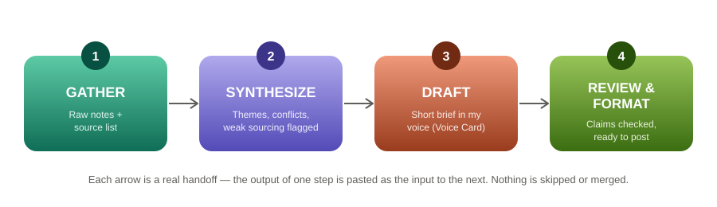

# Ship an Automation Workflow v2 — Weekly AI/SEO Industry Brief
**Jackline Mutheu**

**Pipeline chosen:** "Weekly industry brief" — tracking AI + SEO/content-marketing news, directly useful for FlyRank/ML-track context.
**Tool:** A single Claude Project with four structured, sequential prompts (no separate accounts needed — matches the same "free, matches my skill level" reasoning from the Three Roads assignment).

---

## Step Diagram

Each arrow is a real handoff: the output of one step is pasted as the input to the next. Nothing is skipped or merged.

---

## The Four Prompts (as Claude Project structured instructions)

**1. GATHER**
> You will be given 3–6 raw source snippets on one AI/SEO/content-marketing topic. Extract only concrete, checkable facts: what changed, who said it, and the date if given. One line per fact. Tag each fact with its source. Do not summarize or interpret yet — just extract. If two sources report the same fact, list it once and note both sources. Flag anything stated as "unconfirmed" as unconfirmed, not fact.

**2. SYNTHESIZE**
> You will be given a list of tagged facts from the Gather step. Group them into 2–4 themes. For each theme, note: what's consistent across sources, what conflicts (if anything), and whether any claim rests on thin sourcing (one blog repeating another's claim with no primary source). Do not draft prose yet — output structured notes only.

**3. DRAFT**
> You will be given synthesized theme notes. Write a short brief (150–250 words) in this voice: practical, clear, honest, curious, evidence-based, approachable — no buzzwords, no hype language, explain rather than exaggerate. Structure: one theme per short paragraph, lead with the most actionable theme.

**4. REVIEW & FORMAT**
> You will be given a draft brief. Check every claim against the synthesis notes — flag anything the draft states more confidently than the source supported. Tighten wording. Format with a one-line headline per theme (bold) followed by 2–3 sentences. End with a one-line "what to watch next week" note.

---

## Five Real Runs

### Run 1 — Google Algorithm & Search Volatility

**Gather (facts extracted from 3 sources):**
- June 2026 spam update: confirmed, ran worldwide, targeted SpamBrain spam-detection systems specifically (not general ranking). [Numinix; SEO Vendor]
- No broad core update in July; the May 2026 core update had already settled by early June. [Numinix]
- Next broad core update expected Q3 2026 (August–September), based on the typical 3–4 month cadence. [Numinix]
- An **unconfirmed** weekend ranking blip (July 18–19) was visible across 14 independent SERP-tracking tools, but Google's own Search Status Dashboard showed nothing. [Digital Applied]
- A separate unconfirmed "July 11" blip is reportedly already reversing, one week later. [Digital Applied]

**Synthesize:**
- Theme A (confirmed, actionable): the June spam update is real, done, and specifically targets spam — not a reason to rewrite good content.
- Theme B (speculative, low-confidence): two separate "unconfirmed" July blips are circulating in SEO forums with no Google confirmation — worth noting but not worth reacting to.
- Conflict/thin-sourcing flag: several outlets (SEOroundtable, ZoomYourTraffic, Optimixed) ran near-identical writeups of the same Google monthly report — likely one syndicated source, not independent confirmation.

**Draft → Review & Format (final):**
> **Google's June spam update is done — don't over-correct.** The confirmed June 2026 spam update specifically targeted SpamBrain's spam-detection systems, not general rankings. If your traffic dropped and your content is genuinely solid, this update likely isn't why.
>
> **Two "unconfirmed" ranking blips are circulating — treat with real skepticism.** SERP-tracking tools flagged unusual movement around July 11 and again July 18–19, but Google's own status dashboard shows nothing confirmed for either. One is already reportedly reversing on its own.
>
> *What to watch next week:* whether Google confirms anything about the July blips, and early signals for the expected Q3 (Aug–Sept) core update.

---

### Run 2 — AI-Generated Content Disclosure Policy

**Gather:**
- YouTube's AI detection system (live since May 2026) auto-labels undisclosed synthetic content; creators cannot remove a platform-applied label. [ytZolo]
- Google confirmed disclosed AI content faces **no** distribution/monetization penalty — the label is transparency-only, not a ranking penalty. [ytZolo]
- Meta can reduce distribution up to ~80% for AI content judged *deceptive* specifically — not for AI use generally. [AuditSocials]
- TikTok's policy: "when in doubt, disclose" — automated detection via C2PA metadata scanning runs regardless of self-disclosure. [AuditSocials]
- EU AI Act labeling obligations begin phasing in **August 2026**. [AuditSocials]

**Synthesize:**
- Theme A (consistent across platforms): disclosure itself is not penalized anywhere — enforcement targets *non-disclosure* or *deceptive* framing, not AI use itself.
- Theme B (upcoming, actionable): EU AI Act labeling rules begin phased rollout in August — a real date, not speculative.
- Thin-sourcing flag: most of these came from one recurring publisher (AuditSocials) covering multiple platforms — good for breadth, but it's not independent cross-verification of each platform's policy; would want to check platform help-docs directly before treating as final.

**Draft → Review & Format (final):**
> **Disclosing AI content isn't the risk — hiding it is.** Across YouTube, Meta, and TikTok, properly disclosed AI-generated content faces no ranking or monetization penalty. Enforcement targets undisclosed or deceptive use, not AI itself.
>
> **The EU AI Act's labeling rules start phasing in this August.** If any of my work (or FlyRank client work) touches EU audiences, this is a real compliance date, not a someday-concern.
>
> *What to watch next week:* whether platform-specific help docs (not just secondary blog coverage) confirm the same disclosure-not-penalized framing — worth verifying at the source before repeating it as settled.

---

### Run 3 — New LLM / AI Model Releases

**Gather:**
- Claude Opus 5 released July 24, 2026 — most recent flagship tracked. [LLM Gateway]
- Grok 4.5 released July 8, 2026. [LLM Gateway]
- GLM-5.2 (Zhipu AI, MIT license, 744B parameters) released mid-June 2026, currently ranked #1 open-weight model on one benchmark index. [Shakudo]
- Kimi K3 (Moonshot), a 2.8-trillion-parameter open-weight MoE model, shipped July 16, 2026 — described as the largest open-weight model release to date. [Taskade]
- AI-text-detection startup Pangram raised $9M and released Pangram 4.0 plus a new image-detection model. [LLM-stats]

**Synthesize:**
- Theme A: frontier proprietary models (Claude Opus 5, Grok 4.5) and frontier open-weight models (GLM-5.2, Kimi K3) are both moving fast — open-weight is closing the gap on raw scale, not just cost.
- Theme B (tangential but relevant to Run 2): the detection-tooling side is *also* getting funded and released, reinforcing that disclosure/detection is a growing parallel industry, not a side note.
- Weak-sourcing flag: parameter counts and "#1 ranked" claims come from the vendors' own leaderboards/blogs (Shakudo, Taskade) — genuinely useful as a pulse-check, but not independently benchmarked by a neutral third party in what I gathered.

**Draft → Review & Format (final):**
> **Open-weight models are closing the scale gap on frontier labs.** Kimi K3 (2.8T parameters, released July 16) is now described as the largest open-weight release to date, while GLM-5.2 holds the top open-weight spot on at least one benchmark index. Worth noting these rankings come from the models' own vendors/trackers, not independent third-party benchmarks.
>
> **Proprietary frontier models kept shipping too:** Claude Opus 5 (July 24) and Grok 4.5 (July 8) were the two most recent flagship releases tracked this month.
>
> *What to watch next week:* whether any independent benchmark (not vendor-published) corroborates the open-weight leaderboard claims.

---

### Run 4 — AI in Content Marketing Strategy

**Gather:**
- eMarketer's Feb 2026 analysis names the shift from "AI tools" to "AI agent systems" (composable, agent-first stacks) as 2026's defining martech trend. [Enrich Labs]
- Human review is still explicitly required for: brand voice accuracy, factual accuracy (AI can confidently state wrong stats), and unique proprietary insight. [Enrich Labs]
- Industry framing (CMI, cited secondhand) describes AI moving "from a productivity tool... to an orchestration system," while another source (Spark Novus, cited secondhand) warns teams want brand-aligned content, not "AI slop." [Marketing Agent Blog]
- Content strategy in 2026 is framed as serving two systems at once: traditional search ranking *and* generative-engine citation (AI Overviews, ChatGPT, Perplexity). [Marketing Agent Blog]

**Synthesize:**
- Theme A (actionable, consistent): the human-review layer (brand voice, facts, original insight) is repeatedly named as non-negotiable, not optional — this shows up across every source in this run.
- Theme B: "optimize for both traditional search and AI citation" is stated as the 2026 baseline expectation, not a future consideration.
- Thin-sourcing flag: the CMI and Spark Novus quotes are both cited *secondhand* through Marketing Agent Blog — I don't have the primary source, so I'm treating these as "reportedly said," not verified quotes.

**Draft → Review & Format (final):**
> **The human-review layer isn't optional — it's the whole value-add.** Brand voice accuracy, fact-checking, and original insight are named across multiple sources as the specific things AI can't reliably do alone. This matches what FlyRank's own case-study framing already assumes.
>
> **Content now has to satisfy two systems at once:** traditional search ranking and AI-citation visibility (AI Overviews, ChatGPT, Perplexity). This isn't framed as optional anymore — it's the 2026 baseline.
>
> *What to watch next week:* the CMI and Spark Novus statements I found were secondhand quotes — worth finding the primary source before treating them as verified.

---

### Run 5 — Google Search Console / SEO Tooling Updates

**Gather:**
- Google Search Console expanded AI performance reports access and published a help doc on AI controls (letting site owners exclude content from AI Overviews/AI Mode without affecting normal ranking). [SEO Roundtable; Numinix]
- A long-standing Links report bug was fixed this month. [Numinix]
- Search Console now supports "platform properties" — sites can connect Instagram/TikTok/X/YouTube accounts and see Search/Discover performance **even with no website at all**. [Amrita SEO]
- Google's John Mueller pushed back on building separate "AI-only" markdown versions of a site — his stated position: a well-structured normal site already serves people, Google, and AI alike. [Amrita SEO]
- Bing Webmaster Tools is adding Citation Share, Intents, Topics, and Compare to its AI Performance Report. [Position Digital]

**Synthesize:**
- Theme A (actionable): the "platform property" feature is a genuinely new capability — small businesses/creators without a website can now see real Search/Discover data.
- Theme B (actionable, saves wasted effort): Mueller's statement directly answers a question worth checking against — worth taking at face value since it's attributed directly to Google, not secondhand.
- Cross-platform note: Bing is building comparable AI-attribution reporting to Google's, suggesting this is an industry-wide reporting shift, not Google-specific.

**Draft → Review & Format (final):**
> **You don't need a website to see Search Console data anymore.** New "platform properties" let you connect Instagram, TikTok, X, or YouTube directly and see how those posts perform in Google Search and Discover — useful for a channel with no standalone site.
>
> **Skip building a separate "AI-only" version of your site.** Google's John Mueller stated directly that a well-structured normal site already works for people, Google, and AI tools — a second stripped-down version is just more upkeep for no real benefit.
>
> *What to watch next week:* whether Bing's new AI-attribution reporting (Citation Share, Intents, Topics) becomes something worth checking alongside Google's.

---

## Time Accounting (honest, including setup)

| | Manual (no workflow) | With the workflow |
|---|---|---|
| **One-time setup** (writing the 4 structured prompts, testing them once) | — | ~45 min |
| **Per-run: finding/reading 4–5 source articles** | ~20–25 min | ~20–25 min (unchanged — the workflow doesn't speed up finding sources) |
| **Per-run: synthesizing + writing the brief** | ~20–30 min (re-reading, drafting, and self-editing by hand) | ~8–10 min (paste sources in, run the 4 prompts in sequence, light final edit) |
| **Total per run** | ~45–55 min | ~28–35 min |
| **Total across 5 runs (after setup)** | ~4 hours | ~2.3 hours + 45 min setup ≈ 3 hours |

**Honest takeaway:** the workflow doesn't save time on *finding* sources — that's still manual reading either way. The real time savings are in synthesis and drafting, where having four narrow, single-purpose prompts stops me from re-reading everything twice while trying to write and organize at the same time. Over one run, the setup cost nearly cancels the savings; the payoff shows up starting around run 2–3 onward, once the 45-minute setup is already paid for.

---

## Where It Breaks — What a Human Must Still Check

1. **Syndicated/mirrored sources look like independent confirmation and aren't.** In Run 1, three different outlets ran near-identical write-ups of the same Google monthly report. The Gather step can't tell a mirror from a second independent source — a human has to recognize the repetition and not double-count it as corroboration.
2. **"Unconfirmed" claims can slip into confident-sounding prose if not caught at Review.** The workflow's structure catches this (Run 1's weekend blip stayed flagged as unconfirmed through to the final brief), but this only works because the Gather step is instructed to flag it explicitly — if a source doesn't self-label as unconfirmed, the workflow has no way to know.
3. **Secondhand quotes need primary-source verification the workflow can't do on its own.** Run 4's CMI/Spark Novus quotes came through a third party. The workflow correctly flagged this, but a human still has to go find the primary source before citing those quotes anywhere more formal.
4. **Vendor-published rankings (leaderboards, "#1 open-weight model") need outside verification.** Run 3's benchmark claims all traced back to the model-makers' own trackers. The workflow flags the sourcing pattern, but can't independently verify a benchmark claim — that requires a human to actually check a neutral evaluation.
5. **The workflow has no fact-checking step of its own** — it can flag *sourcing quality* (thin, secondhand, syndicated) but doesn't verify facts against a ground truth. Every "what to watch next week" line exists because of this limit, not despite it.
