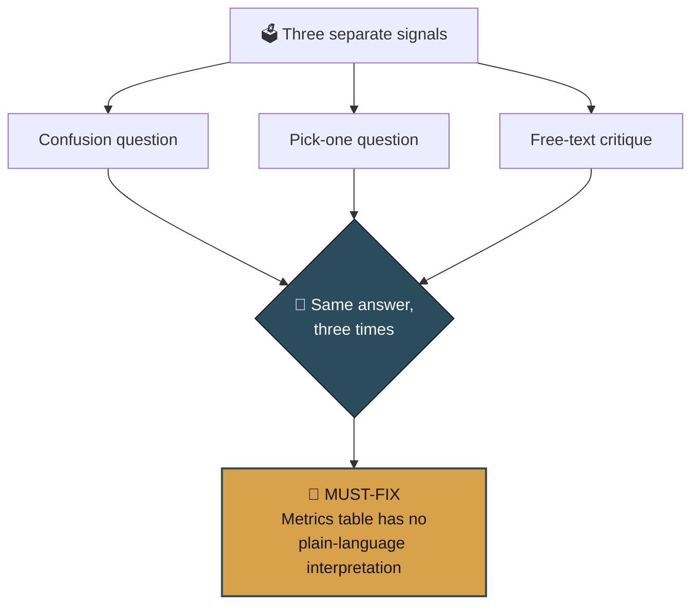
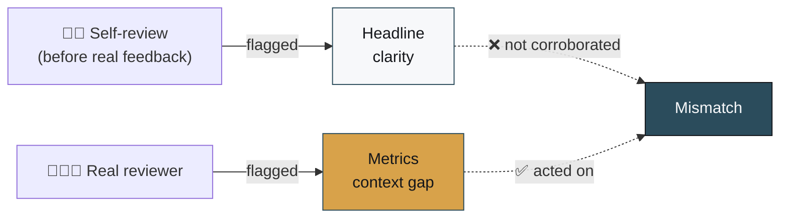

# 🛡️ Survive the Crit 
### Jackline Mutheu · FL-07 AI Fluency Checkpoint

<div align="center">

**Reviewer:** External reviewer, via structured Google Form
**Site under review:** [jacky-gif310.github.io/jackline-portfolio](https://jacky-gif310.github.io/jackline-portfolio/)

</div>

---

## 🎯 Proof Statement

> *"I demonstrate practical machine learning skills by using Python and data analysis workflows to explore datasets, build beginner-level machine learning models, and communicate data-driven insights for real-world decisions... The main action I want them to take is to review my GitHub portfolio and consider me for a machine learning internship or entry-level opportunity."*

---

## 🚪 The Two Opening Questions

| Question | Answer |
|---|---|
| **"In one sentence, what do I actually do?"** | *"You build decision-support ML systems — specifically, a model that ranks which web pages are worth reviewing for a refresh, based on search-performance signals, with the trained model's reasoning and limitations documented alongside it."* |
| **"Would you trust me to do real ML work?"** | 🟡 *"Leaning yes, but something felt thin or unproven."* |

The headline landed. The trust wasn't broken — just not fully earned yet. That gap is the whole story of this checkpoint.

---

## 📋 Full Feedback

```
🔍 One action they'd take   → Check the modeling notebook on GitHub —
                                see the leakage fix in raw code, not just the write-up

😵 Where they got confused  → Case Studies page, the metrics table.
                                ROC-AUC / Precision@50 / Precision@20 given with
                                no baseline → had to reread twice to know if
                                0.320 was good or bad

🛠️  Anything broken        → Nothing. "Everything worked."

🎯 The one thing to fix    → "The evidence doesn't back up the claim"
                                (chosen over: unclear opening claim,
                                confusing navigation, visually broken)
```

**In their own words:**

> ✅ *"Good: the Process page's honesty about false positives/negatives, and the deliberate skip of a fake live demo, are rare and worth keeping as-is."*
>
> ⚠️ *"Critical: the biggest opening for improvement is still context on the metrics — a reader can't tell if Precision@50 = 0.320 is good without a comparison point."*

---

## 🗂️ The Sort



| Bucket | Item(s) |
|---|---|
| 🔴 **Must-fix** *(corroborated 3 ways)* | Metrics table had no plain-language interpretation — a non-expert reader couldn't tell if the results were good or bad |
| 🟢 **Nice-to-have** | None surfaced — no navigation, visual, or broken-link issues reported |
| 🌟 **Keep as-is** *(explicitly praised)* | Process page's honesty about model errors · the decision **not** to fake a live demo |

---

## 🔧 What I Changed

Added one plain-language sentence directly under the metrics table on the Case Studies page:

> *"Precision@50 of 0.320 means roughly 1 in 3 pages the model flags as top-50 priorities are genuine opportunities — versus the baseline's 0.040, which is worse than picking pages at random (the validation set's real opportunity rate was 0.232)."*

**Before → After**

| | Before | After |
|---|---|---|
| Metrics shown | ROC-AUC, Precision@50, Precision@20 — numbers only | Same numbers **+ one interpretation sentence** |
| Reader's task | Infer whether 0.320 is good, unaided | Compare directly against baseline (0.040) and base rate (0.232) |
| Result | 🔁 Reread the paragraph twice | ✅ Answer is stated plainly |

---

## 🪞 Note on Process



I ran an initial self-review before getting real feedback, and it flagged the headline as the top concern. The actual reviewer disagreed entirely — they picked the metrics-context gap instead, and never flagged the headline at all.

That mismatch is exactly why this checkpoint requires a real second pair of eyes rather than self-analysis: **I couldn't see the actual gap until someone else pointed at it.**

---

## ✅ Verified Live

Site re-checked after the fix — the updated metrics context is confirmed live at:

🔗 **[jacky-gif310.github.io/jackline-portfolio/case-studies.html](https://jacky-gif310.github.io/jackline-portfolio/case-studies.html)**

<div align="center">

---
**Status: Crit survived.** 🎉 One corroborated gap, one targeted fix, verified in production.

</div>
