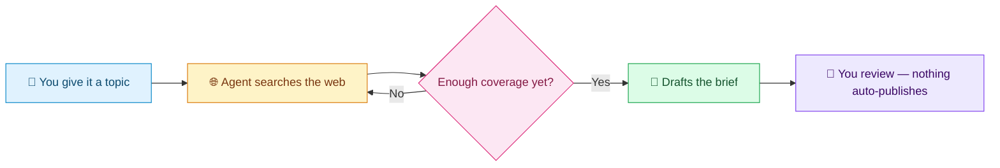
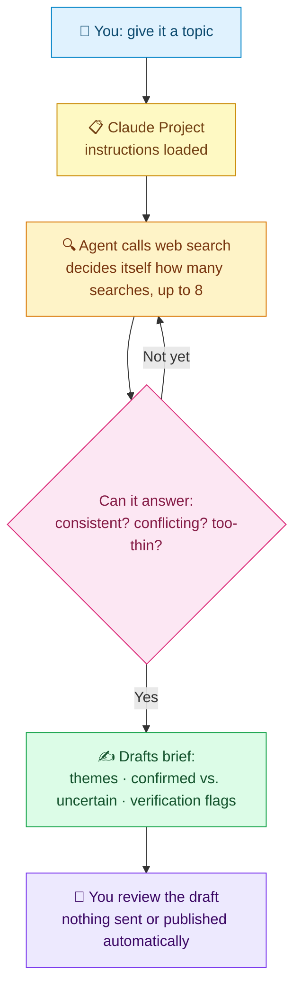
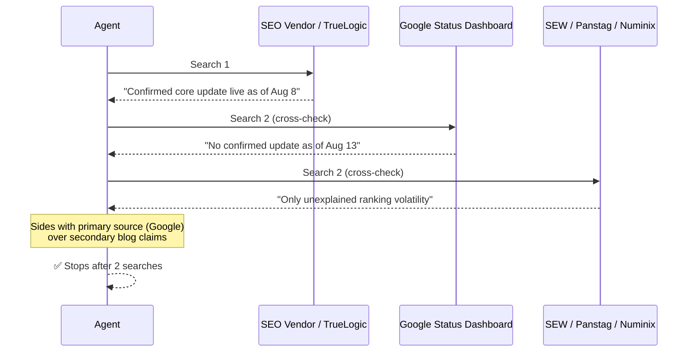

# 🔎 Weekly AI/SEO Research Scout

> A small research agent that reads the internet so you don't have to — and knows when to stop.

A personal research agent that produces a weekly AI/SEO industry brief. It's an upgrade from a fixed automation workflow into an *agent*: something that decides, on its own, when it has gathered enough source coverage on a topic — rather than running a preset number of steps.

**Built by:** Jackline Mutheu
**For:** Personal use — a repeatable, source-grounded weekly research habit, reusable by anyone who wants the same thing.

---

## ✨ What it does

Give it one topic — `"Google algorithm updates"`, `"AI content disclosure policy"`, anything current — and it:

1. Searches the web for reliable sources
2. Keeps digging until it can answer three questions:
   - What's **consistent** across sources?
   - What **conflicts**?
   - What's **too thin** to trust yet?
3. Writes a short brief in a specified voice
4. Flags anything that needs **human verification** before it goes anywhere

It does **not** publish, post, or send anything on its own. Every output is a draft for human review — always.



---

## 🛠️ Setup (a stranger could follow this)

| Step | Action |
|---|---|
| 1 | Go to [claude.ai](https://claude.ai) → **Projects** → **Create project** |
| 2 | Name it `Weekly AI/SEO Research Scout` |
| 3 | Paste the **Project instructions** below |
| 4 | Confirm **web search** is enabled in project/chat settings |
| 5 | *(Optional)* Add a Voice Card or style note to project knowledge, so tone stays consistent without re-specifying it each run |

No paid tools, no API keys, no separate accounts required.

### Project instructions to paste

```
You are my Weekly AI/SEO Research Scout.

Your responsibility is to research current AI and SEO topics and create a trustworthy weekly industry brief.

Follow these rules:
1. Search for reliable sources related to the selected topic.
2. Continue gathering information until: major viewpoints are covered, repeated information appears, conflicts between sources are understood, or you've done 8 searches — whichever comes first. State which one triggered you to stop.
3. Clearly separate: confirmed information, uncertain claims, disagreements between sources.
4. Never invent sources, statistics, quotes, or research findings.
5. Write using my communication style: practical, clear, evidence-based, honest about uncertainty.
6. Before producing the final draft, name anything that needs my verification.
7. Never publish, email, or distribute content — only draft, for my review.
8. Never quote more than 15 words from a single source, and never quote the same source twice.
```

---

## 🚀 Usage example

In a new chat inside the project:

```
This week's brief: Google algorithm updates.
```

The agent searches, decides on its own when it has enough source coverage, and returns a brief structured by theme — confirmed vs. uncertain claims clearly separated, plus a "what to watch next week" note at the end.

To run a different topic, start a new chat with a different subject line. No reconfiguration needed.

---

## 🏗️ Architecture



The key difference from a fixed workflow: **the model decides the stopping point during search**, based on what it actually finds — not a number decided in advance.

---

## 📊 v2 Evaluation Results

Tested live on real, current topics (run August 2026) — not simulated.

### Test 1 — Conflicting sources

**Topic:** `"Google algorithm update August 2026"`



**Result: ✅ Pass** — the agent correctly stopped once the conflict was clear, and reported the honest, less dramatic conclusion: *"unconfirmed volatility, not a confirmed update."*

### Test 2 — Stopping condition on a broad topic

**Topic:** `"AI news this week"` (deliberately broad, per the FL-06 eval case)

One search surfaced six unrelated threads — a military AI story, a math-proof breakthrough, OpenAI's IPO plans, model price cuts, a security incident, and Anthropic's revenue — with no natural single narrative.

**Result: ⚠️ Partial pass** — search worked and surfaced real, current stories, but this exposed a real limitation: on a genuinely broad topic, "enough coverage" isn't obviously definable by repetition or conflict-resolution alone. The agent still has to make an editorial call about which threads matter most, and the current instructions don't explicitly guide it to do that.

> **v3 fix planned:** add an explicit rule for broad/multi-topic subjects — *"if the topic splits into more than 3 unrelated threads, pick the 2 most consequential and say explicitly what was left out."*

| Test | Result | Key finding |
|---|:---:|---|
| Conflicting sources | ✅ Pass | Correctly trusted the primary source over louder secondary claims |
| Broad/multi-topic stopping condition | ⚠️ Partial | "Enough coverage" needs an explicit editorial rule for broad topics |

---

## ⚠️ Limitations

- **Broad topics don't have an obvious stopping point** — confirmed live on "AI news this week." It fragments into unrelated stories with no natural repetition or conflict to resolve, so "enough coverage" becomes an implicit editorial judgment the current instructions don't guide.
- The agent's "enough sources" judgment is its own read of search results — it can be wrong about sufficiency, especially on fast-moving topics.
- No fact-checking beyond what's flagged "needs verification" — a human still has to actually verify before treating anything as settled.
- Doesn't handle paywalled sources — works from what's visible or skips them, which can mean missing coverage where major sources are paywalled.
- No memory between separate chat sessions unless project knowledge files are updated manually.

---

## 🛡️ Guardrails

- 🚫 Never publishes, emails, or distributes output — draft-only, every time
- 🚫 Never quotes more than 15 words from a single source, or quotes the same source twice
- 🚫 Never bypasses a paywall or login wall
- 🚩 Flags unconfirmed claims explicitly rather than stating them as fact

---

<p align="center"><sub>Built with 🩶 as part of the FL-07 FlyRank AI Fluency checkpoint.</sub></p>
